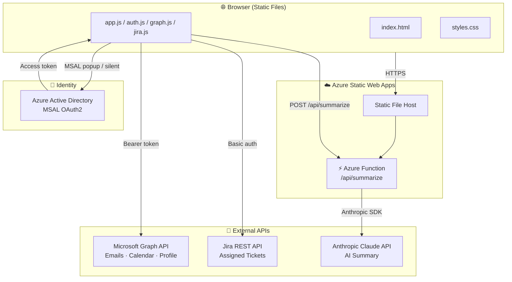
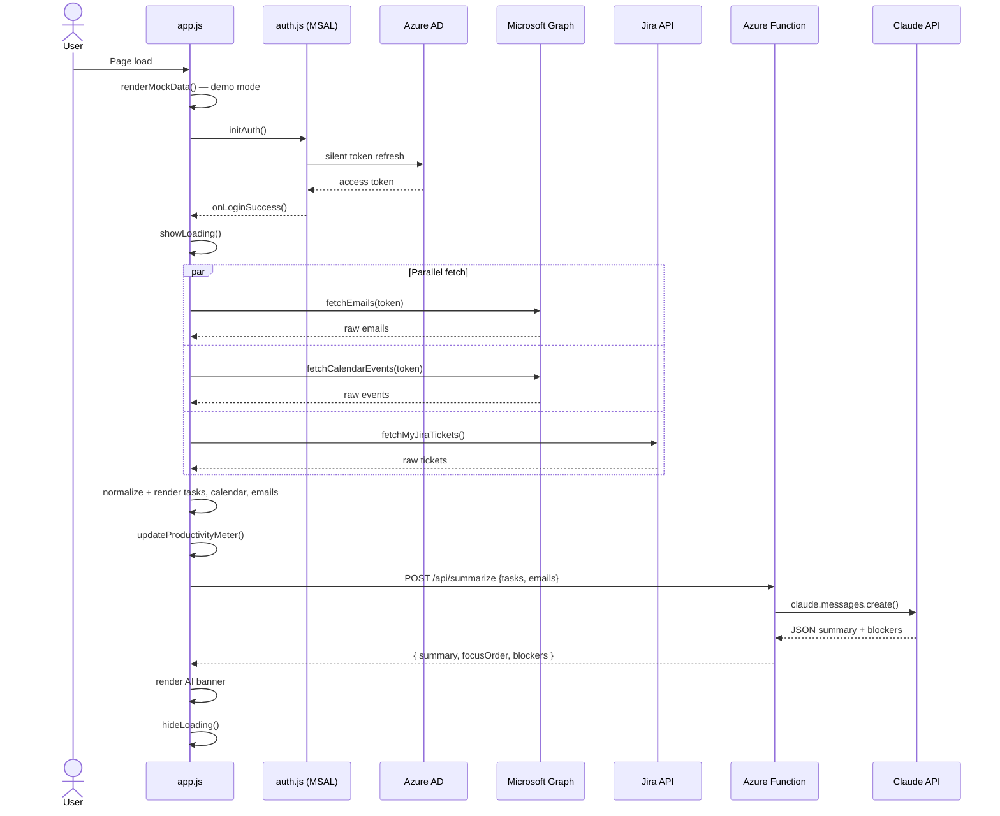
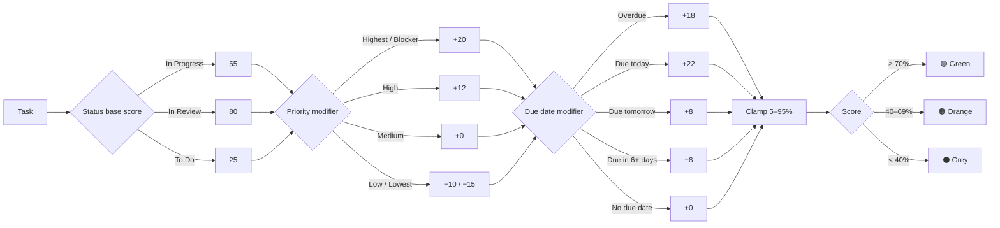

# Command Center

> A unified productivity dashboard for WSD engineers — bringing together Jira tickets, Microsoft 365 calendar, and unread emails in one place, with AI-powered daily briefings and smart completion tracking.

[](https://github.com/wsd-team-digital-workplace/wsddashbordapp/actions/workflows/azure-static-web-apps.yml)


---

## What is Command Center?

Command Center is an internal productivity tool built for the WSD team. Instead of switching between Jira, Outlook, and your calendar all day, Command Center pulls everything into a single clean dashboard and tells you — with the help of Claude AI — what to focus on right now.

Open it in the morning, sign in with your Microsoft account, and within seconds you have:
- Every Jira ticket assigned to you, sorted by urgency
- Today's meetings with one-click join links
- Your unread emails with sender and preview
- An AI-written briefing that reads your task list and emails and tells you what to prioritise, what is blocked, and how to structure your day

No configuration required for a first look — the app loads with realistic demo data the moment you open it.

```
┌─────────────────────────────────────────────────────────────────────────┐
│  ● CMD CENTER        Tuesday, 2 June 2026          ↺ Sync   👤 Md. Kobir│
├──────────┬──────────┬────────────────┬─────────────────────────────────┤
│  7       │  2       │  4             │  6                              │
│  Open    │  Done    │  Meetings      │  Unread Emails                  │
│  Tickets │  Today   │  Today         │                                 │
├──────────┴──────────┴────────────────┴─────────────────────────────────┤
│ ✦ AI  WSD-112 is overdue — fix auth token bug first. WSD-108 and        │
│       WSD-103 are due today with strong completion likelihood.           │
├─────────────────────────────────────────────────────────────────────────┤
│  Daily Productivity  ████████████████░░░░  74%  Productive              │
│                      3 active · 1 overdue · 4 meetings                  │
├───────────────────────────────────┬─────────────────────────────────────┤
│  ● JIRA TICKETS — TODAY'S FOCUS   │  ● TODAY'S SCHEDULE                 │
│  [All] [Critical] [High] [Medium] │                                     │
│                                   │  09:00  Daily Standup         Teams │
│  🔴 WSD-112  In Progress  ▓▓▓▓▓ 95%│  10:30  Design Review — CC v2  ●now│
│  🟠 WSD-108  In Progress  ▓▓▓▓░ 87%│  14:00  1:1 with Sarah       Teams │
│  🟠 WSD-105  In Review    ▓▓▓▓░ 80%│  15:30  Sprint Retrospective       │
│  🟠 WSD-103  In Progress  ▓▓▓░░ 77%│                                     │
│  🟡 WSD-99   To Do        ▓░░░░ 25%│                                     │
├───────────────────────────────────┴─────────────────────────────────────┤
│  ● UNREAD EMAILS                                                        │
│  SC  Sarah Chen       Re: Command Center demo — Thursday confirmed   6m │
│  JA  Jira Automation  [WSD-112] Critical bug escalated              18m │
│  AD  Azure DevOps     Pipeline cmd-center-main — Build #158 ✓       35m │
└─────────────────────────────────────────────────────────────────────────┘
```

---

## Features

### 1. Microsoft Single Sign-On
Sign in with your WSD Microsoft 365 account in one click. Authentication is handled by the Microsoft Authentication Library (MSAL) with silent token refresh — no passwords stored, no separate login to manage. Scopes requested: `User.Read`, `Mail.Read`, `Calendars.Read`.

### 2. Live Stats Bar
Four at-a-glance metrics always visible at the top of the page:
- **Open Tickets** — count of your non-done Jira tasks
- **Done Today** — tickets you closed today (motivating progress tracker)
- **Meetings** — how many calendar events are scheduled today
- **Unread Emails** — current unread count from your inbox

### 3. AI Priority Briefing (Powered by Claude)
After your data loads, the app sends your task list and recent emails to a serverless Azure Function that calls the Anthropic Claude API. Claude reads everything and writes a 2–3 sentence briefing telling you:
- What to work on first and why
- Which tasks are likely to be completed today
- Any blockers or urgent items flagged in your emails

The AI summary updates every time you refresh.

### 4. Daily Productivity Meter
A live progress bar at the top of the dashboard scores your day from 0–100% based on how many tasks are active, how many are overdue, and how many meetings are scheduled. Labels range from **Slow Day** through **On Track**, **Productive**, to **Peak Performance**.

### 5. Per-Task Completion Likelihood
Every Jira ticket displays a colour-coded mini progress bar and percentage showing the probability of completing it today. The score is calculated from three signals:
- **Status** — In Progress and In Review score higher than To Do
- **Priority** — Highest/Critical tasks get an urgency boost
- **Due date** — Due today or overdue lifts the score; due in 6+ days lowers it

Green (≥70%) · Orange (40–69%) · Grey (<40%)

### 6. Priority Filter Pills
The Jira tasks panel has instant filter buttons — **All**, **Critical**, **High**, **Medium** — so you can focus on the tier that matters right now without leaving the page. The total ticket count in the badge always reflects your full backlog.

### 7. Today's Calendar with Join Links
All of today's calendar events are listed with start/end times and location. Events that are happening right now are highlighted in green. Online meetings show a clickable join button that opens your Teams or meeting URL directly.

### 8. Unread Email Feed
Your most recent unread emails are shown with sender avatar, subject, preview text, and relative time. Colour-coded avatars make senders easy to recognise at a glance.

### 9. Demo Mode — No Sign-In Required
The app loads instantly with realistic mock data so you can explore every feature before connecting any account. Click **Sign in with Microsoft** when you're ready to switch to your live data.

### 10. Responsive & Fast
Built with vanilla HTML, CSS, and JavaScript — no framework overhead. Loads in under a second. Fully responsive: two-column layout on desktop collapses to single-column on tablet and mobile.

---

## Architecture



---

## Data Flow



---

## Completion Likelihood Algorithm

Each task receives a `% likely today` score shown as a colour-coded mini bar:



---

## Daily Productivity Score

The meter at the top of the dashboard is calculated from live task and calendar data:

| Factor | Points |
|--------|--------|
| Base score | 40 |
| Each active task (In Progress / Review) | +8 (max 25) |
| Each overdue task | −10 |
| Each calendar event today | +4 (max 20) |

| Score | Label |
|-------|-------|
| 96–100 | Peak Performance |
| 81–95 | High Output |
| 66–80 | Productive |
| 51–65 | On Track |
| 31–50 | Getting Started |
| 0–30 | Slow Day |

---

## CI/CD Pipeline

```mermaid
flowchart TD
    DEV[👨‍💻 Developer] -->|git push main| GH[GitHub Repository]
    DEV -->|open Pull Request| PR[Pull Request]

    GH -->|triggers| WF["⚙️ GitHub Actions\nazure-static-web-apps.yml"]
    PR -->|triggers| WF

    WF --> CHK[actions/checkout@v4]
    CHK --> NODE[setup-node@v4\nNode 20 + npm cache]
    NODE --> INST[npm ci\napi/summarize]
    INST --> DEPLOY["Azure/static-web-apps-deploy@v1\nupload"]

    DEPLOY -->|main branch| PROD["🌐 Production\nhttps://your-app.azurestaticapps.net"]
    DEPLOY -->|pull request| PREV["🔍 Preview URL\nhttps://your-app-pr-42.azurestaticapps.net"]

    PR -->|closed| CLEAN["Azure/static-web-apps-deploy@v1\nclose — removes preview env"]
```

---

## Project Structure

```
wsddashbordapp/
├── index.html                  # App shell — layout, section scaffolding
├── app.js                      # Core logic: render, productivity meter, likelihood
├── auth.js                     # MSAL authentication — login / token refresh
├── graph.js                    # Microsoft Graph helpers — emails, calendar, profile
├── jira.js                     # Jira REST API helpers — tickets, normalisation
├── styles.css                  # Design system — variables, components, responsive
├── staticwebapp.config.json    # Azure SWA routing + Content-Security-Policy
├── package.json                # Frontend dev dependency (http-server)
├── .env.example                # Required environment variable reference
├── api/
│   └── summarize/
│       ├── index.js            # Azure Function — calls Claude API, returns JSON
│       ├── function.json       # Function binding (HTTP trigger)
│       └── package.json        # @anthropic-ai/sdk dependency
└── .github/
    └── workflows/
        └── azure-static-web-apps.yml  # GitHub Actions CI/CD
```

---

## Getting Started (Local Dev)

### Prerequisites

- Node.js 20+
- A Microsoft 365 account (or use demo mode — no sign-in required)
- Optional: Jira Cloud account, Anthropic API key

### 1. Clone and install

```bash
git clone https://github.com/your-org/wsddashbordapp.git
cd wsddashbordapp
npm install
cd api/summarize && npm install && cd ../..
```

### 2. Configure environment variables

Copy `.env.example` to `.env` and fill in your values:

```env
# Azure AD app registration
CLIENT_ID=your-azure-ad-client-id
TENANT_ID=your-tenant-id

# Jira Cloud
JIRA_BASE_URL=https://your-org.atlassian.net
JIRA_EMAIL=you@company.com
JIRA_TOKEN=your-jira-api-token

# Claude API (Azure Function only — not exposed to browser)
CLAUDE_API_KEY=sk-ant-...
```

> **Demo mode** — the app renders mock data immediately without any configuration. Sign-in and live data are optional.

### 3. Run locally

```bash
npm start
# → http://localhost:3000
```

---

## Deployment to Azure

### Step 1 — Create the Azure Static Web App

1. [portal.azure.com](https://portal.azure.com) → **Create a resource** → **Static Web App**
2. Configure:
   - **Name:** `command-center` (or your choice)
   - **Plan:** Free
   - **Deployment source:** GitHub — select your repo + `main` branch
   - **App location:** `/`
   - **Api location:** `api`
   - **Output location:** *(leave blank)*
3. Click **Review + Create**

### Step 2 — Copy the deployment token

Azure portal → your Static Web App → **Manage deployment token** → copy.

### Step 3 — Add GitHub secret

Repo → **Settings** → **Secrets and variables** → **Actions** → **New repository secret**:

| Name | Value |
|------|-------|
| `AZURE_STATIC_WEB_APPS_API_TOKEN` | paste token from Step 2 |

### Step 4 — Add Claude API key to Azure

Azure portal → your Static Web App → **Configuration** → **+ Add**:

| Name | Value |
|------|-------|
| `CLAUDE_API_KEY` | your Anthropic API key |

### Step 5 — Push to deploy

```bash
git push origin main
```

GitHub Actions deploys automatically. Your app goes live at:

```
https://<your-app-name>.azurestaticapps.net
```

Pull requests automatically receive a **preview URL** and are cleaned up when the PR is closed.

---

## Environment Variables Reference

| Variable | Where used | Description |
|----------|-----------|-------------|
| `CLIENT_ID` | Browser (`auth.js`) | Azure AD app registration client ID |
| `TENANT_ID` | Browser (`auth.js`) | Azure AD tenant ID |
| `JIRA_BASE_URL` | Browser (`jira.js`) | Your Jira Cloud base URL |
| `JIRA_EMAIL` | Browser (`jira.js`) | Jira account email for basic auth |
| `JIRA_TOKEN` | Browser (`jira.js`) | Jira API token |
| `CLAUDE_API_KEY` | Azure Function only | Anthropic API key — never sent to browser |

---

## Tech Stack

| Layer | Technology |
|-------|-----------|
| Frontend | Vanilla JS · HTML5 · CSS3 |
| Authentication | MSAL (Microsoft Authentication Library) |
| Email & Calendar | Microsoft Graph API |
| Task tracking | Jira REST API |
| AI Summaries | Anthropic Claude (via Azure Function) |
| Hosting | Azure Static Web Apps |
| Serverless API | Azure Functions (Node.js) |
| CI/CD | GitHub Actions |
