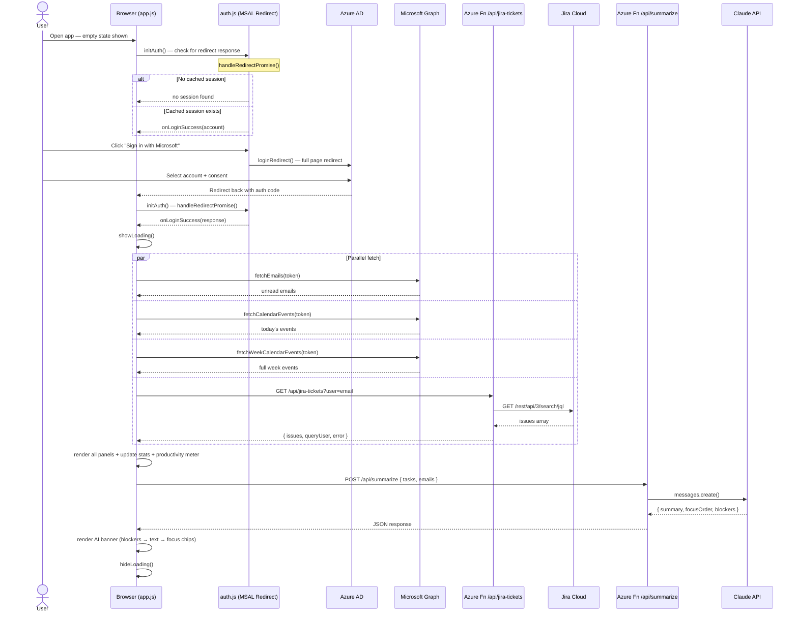

# DayBridge

> A unified productivity dashboard for WSD — bringing together Jira tickets, Microsoft 365 calendar, and unread emails in one place, with AI-powered daily briefings, per-task completion likelihood, and a live productivity score.

[](https://github.com/Kobir-Bappy/DayBridge/actions/workflows/azure-static-web-apps-gentle-bush-0d4ceb603.yml)


**Live URL:** https://gentle-bush-0d4ceb603.7.azurestaticapps.net

---

## What is DayBridge?

DayBridge is an internal productivity tool for WSD. Sign in with your Microsoft 365 account and get a single dashboard showing everything you need to focus on — Jira tickets, today's meetings, unread emails, and an AI briefing that tells you what to prioritise, what is blocked, and how your day looks.

```
┌──────────────────────────────────────────────────────────────────────────────┐
│  ✓ DayBridge        Wednesday, 3 June 2026          Md. Kobir Hosan  Sign out│
│  ● Connected  ↺ Refresh                                    Last updated 12:01│
├──────────┬───────────┬─────────────────┬────────────────────────────────────┤
│  9       │  0        │  5              │  10                                │
│  Open    │  Done     │  Meetings       │  Unread Emails                     │
│  Tickets │  Today    │  Today          │                                    │
├──────────┴───────────┴─────────────────┴────────────────────────────────────┤
│ ✦ AI SUMMARY                                                                │
│  ⚠ Deployment pipeline broken    ⚠ Security alert: Defender                │
│  ⚠ DW-944 stuck in Waiting       ⚠ DW-913 on hold                          │
│                                                                              │
│  Your DayBridge deployment has failed twice. Review Defender security        │
│  alerts. 9 Jira tickets open including 4 onboarding tasks for June 1st.    │
│                                                                              │
│  ↑ Review security alerts   ↑ Fix CI/CD pipeline   ↑ Continue onboarding   │
├──────────────────────────────────────────────────────────────────────────────┤
│  Daily Productivity  ██████████████████░░  85%  High Output                 │
│                      7 active · 5 meetings                                  │
├─────────────────────────────────┬────────────────┬──────────────────────────┤
│  ● JIRA TICKETS — TODAY'S FOCUS │  ● SCHEDULE    │  ● UNREAD EMAILS        │
│  [kobir.hosan@wsd.com]          │  Mon Tue Wed   │                         │
│  [All][Critical][High][Medium] 9│  1   2  [3]    │  K Kobir-Bappy  Today   │
│                                 │      ●  ●●●    │  [wsd-team-digital...]  │
│  DW-974 Need Access for Cursor  │                │                         │
│  IN PROGRESS  M  65%            │  TODAY         │  M Microsoft Defender   │
│                                 │  01:30 Canceled│  Microsoft 365 Defende  │
│  DW-944 Nagstamon Setup         │  Product & Tech│                         │
│  WAITING  M  25%                │  Microsoft     │                         │
└─────────────────────────────────┴────────────────┴──────────────────────────┘
```

---

## Features

### 1. Microsoft Single Sign-On (Redirect-based)
Sign in with your WSD Microsoft 365 account via a full-page redirect — no popup, no first-attempt failures. Uses MSAL with silent token refresh. After signing in, the app fetches all data automatically.

**Scopes:** `User.Read` · `Mail.Read` · `Calendars.Read`

### 2. Live Stats Bar
Four at-a-glance metrics always visible:

| Metric | Source |
|--------|--------|
| Open Tickets | Jira API — non-Done tickets assigned to you |
| Done Today | Jira API — tickets with Done status |
| Meetings | Microsoft Graph — calendar events today |
| Unread Emails | Microsoft Graph — unread inbox count |

### 3. AI Priority Briefing (Powered by Claude)
After data loads, a serverless Azure Function sends your tasks and emails to Anthropic's Claude API. The response is displayed as:
- **Blocker chips** (red) — urgent issues and security alerts at the top
- **Summary paragraph** — 2–3 sentence daily briefing
- **Focus chips** (purple) — recommended priority order at the bottom

Falls back to a stat summary (`9 tickets · 5 meetings · 10 emails`) if Claude is unavailable.

### 4. Daily Productivity Meter
Live 0–100% score with label:

| Score | Label |
|-------|-------|
| 96–100 | Peak Performance |
| 81–95 | High Output |
| 66–80 | Productive |
| 51–65 | On Track |
| 31–50 | Getting Started |
| 0–30 | Slow Day |

Calculated from: `40 base + (active tasks × 8, max 25) − (overdue × 10) + (meetings × 4, max 20)`

### 5. Per-Task Completion Likelihood
Each ticket shows a mini progress bar + % score:

- **Base:** In Progress = 65, In Review = 80, To Do = 25
- **Priority boost:** Highest/Blocker +20, High +12
- **Due date:** Due today +22, overdue +18, due tomorrow +8, 6+ days away −8
- **Colour:** Green ≥70% · Orange 40–69% · Grey <40%

### 6. Priority Filter Pills
**All · Critical · High · Medium** — filters the task list instantly. Badge always shows the total backlog count.

### 7. Jira User Badge
The tasks card header shows which email is being queried (`kobir.hosan@wsd.com`). If the Jira API returns an error (e.g. user not found), a red ⚠ badge appears instead — making it easy to diagnose multi-user issues.

### 8. 3-Column Layout
- **Left (wide):** Jira tickets with likelihood bars
- **Centre:** Schedule card — weekly strip (Mon–Sun with event dots) + today's events below
- **Right:** Email side panel (not at the bottom)

### 9. Weekly Schedule Strip
A compact 7-day view at the top of the Schedule card shows which days have events. Today is highlighted in blue. Event dots (green = currently happening) show load at a glance.

### 10. Clickable Items
- **Jira tickets** → open in Jira (`wallstreetdocs.atlassian.net/browse/...`)
- **Meetings with Teams link** → open Teams join URL
- **Emails** → open Outlook Web inbox

---

## Architecture

```mermaid
graph TB
    subgraph Browser["🌐 Browser (Static Files — Azure SWA)"]
        HTML[index.html]
        JS[app.js · auth.js · graph.js · jira.js]
        MSAL_LIB[lib/msal-browser.min.js]
    end

    subgraph AzureFunctions["⚡ Azure Functions"]
        FN_AI[/api/summarize\nClaude AI briefing]
        FN_JIRA[/api/jira-tickets\nJira proxy]
    end

    subgraph Identity["🔐 Microsoft Identity"]
        AAD[Azure Active Directory\nMSAL Redirect OAuth2]
    end

    subgraph ExternalAPIs["🔌 External APIs"]
        GRAPH[Microsoft Graph\nEmails · Calendar · Profile]
        JIRA[Jira REST API\nwallstreetdocs.atlassian.net]
        CLAUDE[Anthropic Claude API]
    end

    Browser -->|redirect login| AAD
    AAD -->|redirect back + token| Browser
    JS -->|Bearer token| GRAPH
    JS -->|GET /api/jira-tickets?user=email| FN_JIRA
    FN_JIRA -->|Basic Auth + JIRA_TOKEN| JIRA
    JS -->|POST /api/summarize| FN_AI
    FN_AI -->|CLAUDE_API_KEY| CLAUDE
```

---

## Data Flow



---

## CI/CD Pipeline

```mermaid
flowchart TD
    DEV[👨‍💻 Developer] -->|git push main| GH[GitHub: Kobir-Bappy/DayBridge]
    DEV -->|open Pull Request| PR[Pull Request]

    GH -->|triggers| WF["⚙️ GitHub Actions\nazure-static-web-apps-gentle-bush-0d4ceb603.yml"]
    PR -->|triggers| WF

    WF --> CHK[actions/checkout@v4]
    CHK --> NODE[setup-node@v4 · Node 20 · npm cache]
    NODE --> INST[npm ci in api/summarize]
    INST --> DEPLOY["Azure/static-web-apps-deploy@v1\nskip_app_build: true"]

    DEPLOY -->|main branch| PROD["🌐 Production\nhttps://gentle-bush-0d4ceb603.7.azurestaticapps.net"]
    DEPLOY -->|pull request| PREV["🔍 Preview URL — auto-generated per PR"]
    PR -->|closed| CLEAN[close action — removes preview environment]
```

**GitHub secret required:**

| Secret Name | Value |
|-------------|-------|
| `AZURE_STATIC_WEB_APPS_API_TOKEN_GENTLE_BUSH_0D4CEB603` | Deployment token from Azure portal |

---

## Project Structure

```
DayBridge/
├── index.html                  # App shell — 3-column layout
├── app.js                      # Core logic: render, stats, likelihood, weekly schedule
├── auth.js                     # MSAL redirect auth — login / logout / token refresh
├── graph.js                    # Microsoft Graph — emails, today + week calendar
├── jira.js                     # Jira proxy client — calls /api/jira-tickets
├── styles.css                  # Design system — variables, grid, components
├── staticwebapp.config.json    # Azure SWA routing + CSP headers
├── package.json                # Dev dependency: http-server
├── .env.example                # Local environment variable template (no secrets)
├── .gitignore                  # Excludes .env, node_modules
├── lib/
│   └── msal-browser.min.js     # MSAL served locally (avoids CDN/CSP issues)
├── api/
│   ├── summarize/
│   │   ├── index.js            # Azure Function — Claude AI summary
│   │   ├── function.json       # HTTP trigger binding
│   │   └── package.json        # @anthropic-ai/sdk
│   └── jira-tickets/
│       ├── index.js            # Azure Function — Jira API proxy (keeps token server-side)
│       └── function.json       # HTTP trigger binding
└── .github/
    └── workflows/
        └── azure-static-web-apps-gentle-bush-0d4ceb603.yml  # GitHub Actions CI/CD
```

---

## Local Development

### Prerequisites
- Node.js 20+
- Microsoft 365 account (or browse in demo mode without signing in)
- Optional: Jira Cloud access, Anthropic API key

### 1. Clone

```bash
git clone https://github.com/Kobir-Bappy/DayBridge.git
cd DayBridge
```

### 2. Install dependencies

```bash
npm install
cd api/summarize && npm install && cd ../..
```

### 3. Create local env file

```bash
cp .env.example .env
```

Edit `.env` — **never commit this file**:

```env
# Azure AD App Registration (public values — safe in browser)
CLIENT_ID=your-azure-ad-client-id
TENANT_ID=your-azure-ad-tenant-id

# Jira Cloud (used by Azure Function only — never in browser)
JIRA_BASE_URL=https://wallstreetdocs.atlassian.net
JIRA_EMAIL=you@wsd.com
JIRA_TOKEN=your-jira-api-token

# Anthropic Claude (Azure Function only)
CLAUDE_API_KEY=sk-ant-...
```

### 4. Start

```bash
npm start
# → http://localhost:3000
```

---

## Deployment to Azure — Step by Step

### Step 1 — Create Resource Group

Azure portal → **Resource groups** → **+ Create**

| Field | Value |
|-------|-------|
| Name | `web_apps_internal` |
| Region | UK South (or nearest) |

### Step 2 — Create Static Web App

Inside the resource group → **+ Create** → **Static Web App**

| Field | Value |
|-------|-------|
| Name | `DayBridge` |
| Plan | Free |
| Deployment source | GitHub |
| Organization | `Kobir-Bappy` |
| Repository | `DayBridge` |
| Branch | `main` |
| Deployment authorization | Deployment token |
| App location | `/` |
| Api location | `api` |
| Output location | *(leave blank)* |

Click **Review + create** → **Create**.

Azure automatically commits a workflow file to the repo and creates a GitHub secret with the deployment token.

### Step 3 — Verify GitHub secret

Repo → **Settings** → **Secrets and variables** → **Actions**

Confirm this secret exists (auto-created by Azure):

```
AZURE_STATIC_WEB_APPS_API_TOKEN_GENTLE_BUSH_0D4CEB603
```

If the value is empty, go to Azure portal → DayBridge → **Manage deployment token** → copy and paste it.

### Step 4 — Add environment variables to Azure

Azure portal → DayBridge Static Web App → **Configuration** → **+ Add**:

| Name | Value | Used by |
|------|-------|---------|
| `CLAUDE_API_KEY` | `sk-ant-...` | Azure Function `/api/summarize` |
| `JIRA_TOKEN` | your Jira API token | Azure Function `/api/jira-tickets` |
| `JIRA_EMAIL` | `kobir.hosan@wsd.com` | Azure Function `/api/jira-tickets` |
| `JIRA_BASE_URL` | `https://wallstreetdocs.atlassian.net` | Azure Function `/api/jira-tickets` |

Click **Save**.

> **Important:** `CLIENT_ID` and `TENANT_ID` do NOT go here — they are already hardcoded in `auth.js` (they are public SPA values, not secrets).

### Step 5 — Add redirect URI to Azure AD

Azure portal → **Azure Active Directory** → **App registrations** → DayBridge → **Authentication** → **Single-page application** → **Add URI**:

```
https://gentle-bush-0d4ceb603.7.azurestaticapps.net
```

Click **Save**, then click **Grant admin consent for WSD**.

### Step 6 — Push to deploy

```bash
git add .
git commit -m "initial deployment"
git push origin main
```

GitHub Actions runs automatically. Monitor progress:
`github.com/Kobir-Bappy/DayBridge/actions`

---

## Git Remote — Switch Between Repos

The repo can be pushed to either the WSD org or your personal account:

```bash
# Check current remote
git remote -v

# Switch to personal repo
git remote set-url origin https://github.com/Kobir-Bappy/DayBridge.git

# Switch to org repo
git remote set-url origin https://github.com/wsd-team-digital-workplace/DayBridge.git

# Verify
git remote -v
```

If push is rejected (remote has newer commits):
```bash
git pull origin main --rebase
# resolve any conflicts, then:
git push origin main
```

If still rejected and you're sure your local is correct:
```bash
git push origin main --force
```

---

## Environment Variables Reference

| Variable | Location | Description |
|----------|----------|-------------|
| `CLIENT_ID` | Hardcoded in `auth.js` | Azure AD app client ID — public SPA value |
| `TENANT_ID` | Hardcoded in `auth.js` | Azure AD tenant ID — public SPA value |
| `JIRA_BASE_URL` | Azure portal Configuration | Jira Cloud base URL |
| `JIRA_EMAIL` | Azure portal Configuration | Auth email for Jira Basic Auth |
| `JIRA_TOKEN` | Azure portal Configuration | Jira API token — server-side only |
| `CLAUDE_API_KEY` | Azure portal Configuration | Anthropic API key — server-side only |

> **Jira token security:** The Jira token never reaches the browser. All Jira requests go through the `/api/jira-tickets` Azure Function which reads the token from `process.env.JIRA_TOKEN`.

---

## Azure AD Permissions Required

App registration → **API permissions** → **Microsoft Graph** → **Delegated**:

| Permission | Purpose |
|-----------|---------|
| `User.Read` | Get signed-in user's name for the header |
| `Mail.Read` | Fetch unread emails |
| `Calendars.Read` | Fetch today's and this week's calendar events |

After adding, click **Grant admin consent for WSD** (requires global admin).

---

## Tech Stack

| Layer | Technology |
|-------|-----------|
| Frontend | Vanilla JS · HTML5 · CSS3 (no framework) |
| Authentication | MSAL Browser v2 (redirect flow) |
| Email & Calendar | Microsoft Graph API |
| Task tracking | Jira REST API v3 (`/rest/api/3/search/jql`) |
| Jira security | Azure Function proxy — token never in browser |
| AI Summaries | Anthropic Claude via Azure Function |
| Hosting | Azure Static Web Apps (Free tier) |
| Serverless API | Azure Functions (Node.js, CommonJS) |
| CI/CD | GitHub Actions |
